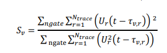
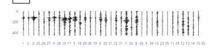
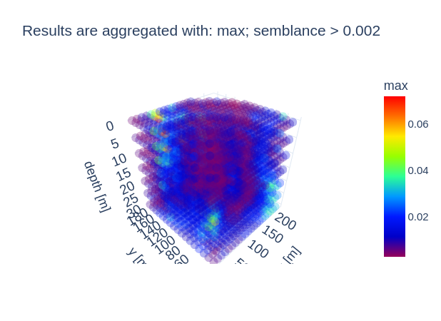
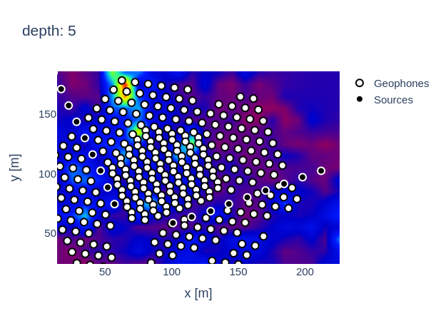
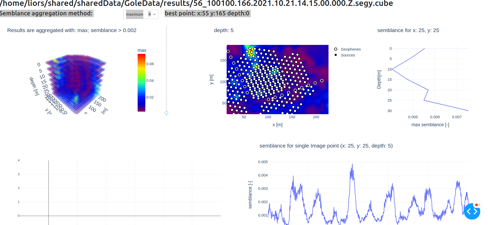
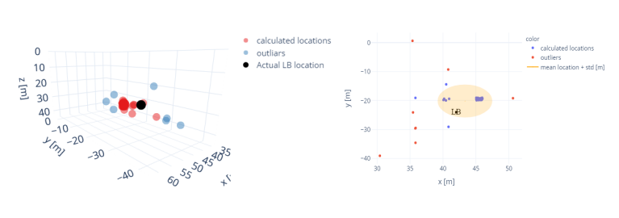

# ctrm
## Introduction
Computed Time Reversal Mirrors is an algorithm for locating sub surface sources of sesimic waves. The algorithm calculates the arrivel time from the possible sources the each reciever. Given a sesmogram record of the signal arrivel, the algorithm calculates the coherency of the signal along the calculated arrivel time surface. The coherency is calculated for each possible source and for each time sample, Thus a 3d space cube is generated for each time sample, where each cell in the cube is the coherency level of a specific possible source.
For the purpose of this algorithm, the coherency is calculated using the Semblance formula.

The formula for coherency/Semblance calculation is given by:

The input is a recording of a signal from an unknown source, e.g.:

Semblance coherency of possible sources is displayed in a 3D cube:

2D slice of coherency for specific depth. Red anomaly demonstrate possible source.

For better observation of the algorithm result, a plotly dash GUI was created: 

## example results
We tested the algorithm with real field data. 60 sesmograms recording a signal from a known source where calculated. The predicted anomalies where aggregated together in a 3D space: 

The calculated anomalies where found to be close together with high precision. Good accuracy was achived as calculated anomalies are in close proximity to the known source.

## classes
- **box.cpp** - The main class for creating the 4d cube. calculates the semblance using the sesmogram and array geometry.
- **3dfile.py** - GUI displaying the 3D cube and slices. In addition displays the semblance by time for each image point.

## parameter list:

1. max x
2. max y
3. min x 
4. min y
5. min z
6. max z
7. dx
8. dy
9.  min t
10. max t
11. velocity range (v+-range)
12. dv
13. radius of relevant recievers in meters
14. average window size
15. dz
16. geometry file
17. velo file
18. energy
